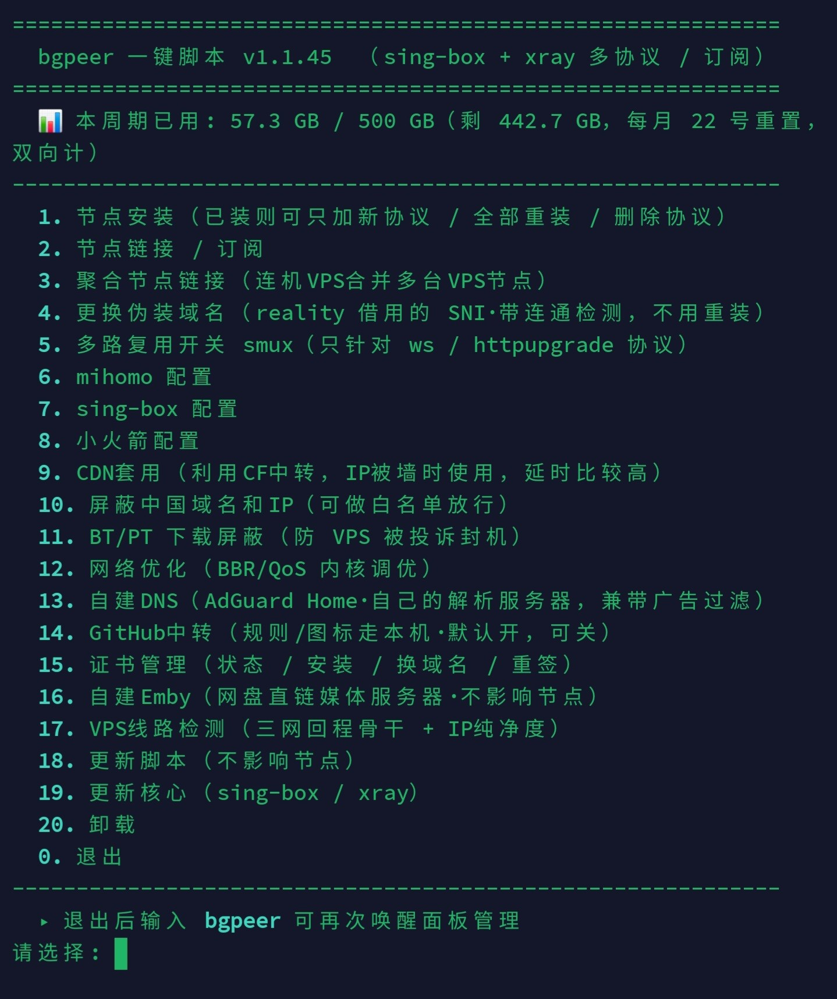

# nodekit · bgpeer 一键脚本

sing-box + xray 双核心、多协议一键部署，自动生成 **mihomo / sing-box / Shadowrocket** 三种订阅，
并可一键屏蔽中国域名/IP（白名单放行）。参考 mack-a/v2ray-agent 的协议组合用 Python 重写，装完直接给客户端一条订阅链接即可。

> ⚠️ 仅供个人学习与合法用途，使用前请阅读文末[免责声明](#免责声明)。

[视频演示](https://youtu.be/XXuaw14Vpk4?is=WR6nu-35Zj5rvD5n) · [Telegram频道](https://t.me/ruleset_bgpeer)

## 环境要求

- Debian / Ubuntu（systemd）
- root 权限
- Python 3

> **提示：** 最好先准备一个域名绑定 VPS（托管在 Cloudflare 的先别开小黄云），可以安装更多的功能节点、效果也更好；没有可以回车直接自签。

## 👇一键安装代码

```bash
curl -sL https://raw.githubusercontent.com/bgpeer/nodekit/main/xy-installer.py -o /tmp/xy.py
sudo python3 /tmp/xy.py
```

若 `raw.githubusercontent.com` 被 GitHub 限流（HTTP 429），改用 jsDelivr 镜像（基本不会限流）：

```bash
curl -sL https://cdn.jsdelivr.net/gh/bgpeer/nodekit@main/xy-installer.py -o /tmp/xy.py
sudo python3 /tmp/xy.py
```

装过一次之后，以后直接敲 **`bgpeer`** 就能打开管理面板（内部已带镜像兜底，会尽量拉最新脚本）。

## 执行后的面板效果图



面板顶部会显示**本机流量**，可以按机房账单口径设置重置日、配额、计费方式，详见 [面板顶部的本机流量](docs/panel-traffic.md)。

## 目录

按面板的顺序，每一项点进去是它自己的说明页。

- [1. 节点安装（已装则可只加新协议 / 全部重装 / 删除协议）](docs/01-install.md)
- [2. 节点链接 / 订阅](docs/02-links.md)
- [3. 聚合节点链接（连机VPS合并多台VPS节点）](docs/03-merge.md)
- [4. 更换伪装域名（reality 借用的 SNI·带连通检测，不用重装）](docs/04-sni.md)
- [5. 多路复用开关 smux（只针对 ws / httpupgrade 协议）](docs/05-smux.md)
- [6. mihomo 配置 · 7. sing-box 配置 · 8. 小火箭配置](docs/06-08-client-config.md)
- [9. CDN套用（利用CF中转，IP被墙时使用，延时比较高）](docs/09-cdn.md)
- [10. 屏蔽中国域名和IP（可做白名单放行）](docs/10-cn-block.md)
- [11. BT/PT 下载屏蔽（防 VPS 被投诉封机）](docs/11-bt-block.md)
- [12. 网络优化（BBR/QoS 内核调优）](docs/12-net-optimize.md)
- [13. 自建DNS（AdGuard Home·自己的解析服务器，兼带广告过滤）](docs/13-dns.md)
- [14. GitHub中转（规则/图标走本机·默认开，可关）](docs/14-github-relay.md)
- [15. 证书管理（状态 / 安装 / 换域名 / 重签）](docs/15-cert.md)
- [16. 自建Emby（网盘直链媒体服务器·不影响节点）](docs/16-emby.md)
- [17. VPS线路检测（三网回程骨干 + IP纯净度）](docs/17-vps-check.md)
- [18. 更新脚本（不影响节点）](docs/18-update-script.md)
- [19. 更新核心（sing-box / xray）](docs/19-update-core.md)
- [20. 卸载](docs/20-uninstall.md)
- [附：Nginx 是共用件](docs/nginx.md)

---

## 相关仓库

- [`bgpeer/rules`](https://github.com/bgpeer/rules) — geosite / geoip 规则集（srs）

---

## 免责声明

1. 本项目（及 `xy-installer.py`、`cn-block.py` 等脚本）仅供**学习、研究与合法用途**，
   用于搭建你**自己拥有或已获授权**的服务器上的网络代理服务。
2. 请在使用前了解并遵守你**所在国家/地区以及服务器所在地**的相关法律法规。
   因使用本项目产生的一切后果（包括但不限于违反当地法律、服务商封停、数据泄露、财产损失等）
   **由使用者自行承担**，项目作者不承担任何责任。
3. 本项目**不提供**任何代理服务、节点或订阅，也不鼓励、不协助任何违法活动。
4. 脚本会安装并运行第三方软件（sing-box、xray 等），并从第三方来源（GitHub、jsDelivr 等）
   下载核心与规则集；这些第三方内容的可用性、安全性与合规性由其各自提供方负责。
5. 本项目按“**现状**”（AS IS）提供，不作任何明示或暗示的担保。作者不保证其无错误、
   不中断或适用于任何特定用途。你需自行评估风险后使用。
6. 一旦下载、安装或使用本项目，即视为你已阅读、理解并同意以上全部条款。

本项目基于 [MIT License](./LICENSE) 开源。
